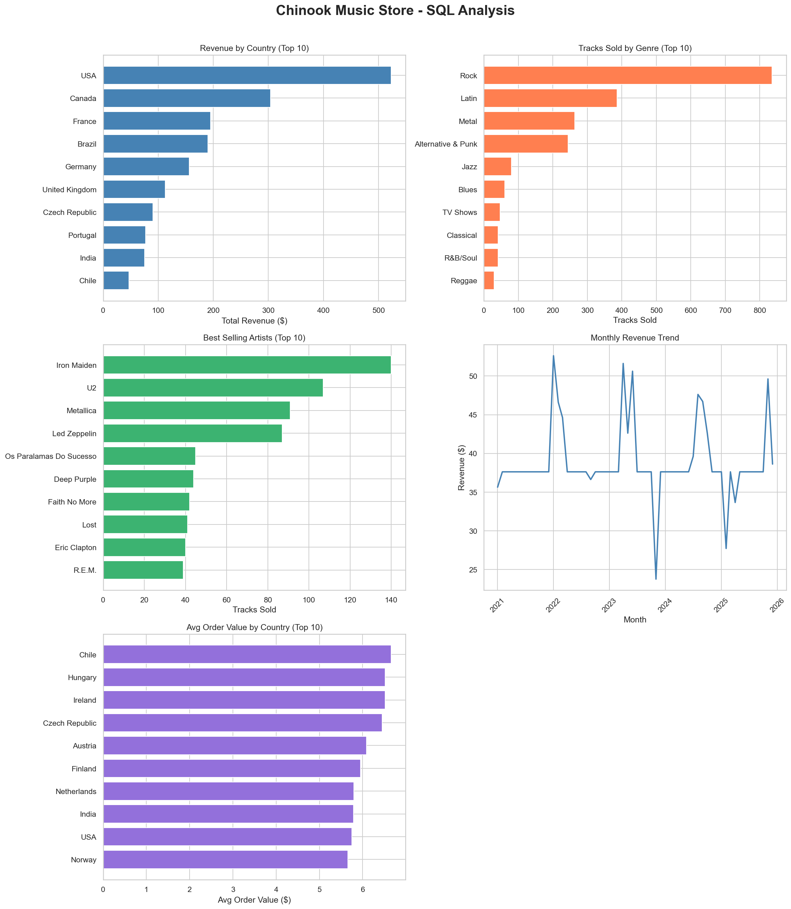

# Chinook Music Store - SQL Analysis

## Overview
Analyzed a digital music store database (Chinook) using PostgreSQL to uncover revenue trends, customer behavior, and catalog performance across 11 tables and 5 years of sales data.

## Tools Used
PostgreSQL, Python (pandas, matplotlib, seaborn), Jupyter Notebook

## Key Findings
- **USA dominates revenue** at $523 (22.5% of all sales) — nearly double Canada in 2nd place
- **Rock accounts for 835 track sales** — more than double the 2nd most popular genre (Latin, 386)
- **Iron Maiden is the best-selling artist** with 140 tracks sold, driven by Rock's dominance
- **43% of the catalog (1,519 of 3,503 tracks) has never been sold** — a major inventory inefficiency
- **Chile has the highest avg order value ($6.66)** despite not cracking the top 10 in total revenue — high spend per order, low volume
- **Revenue is flat over 5 years (~$37/month avg)** — the business is stable but shows no growth

## Business Recommendations
1. **Promote or remove unsold tracks** — 43% of the catalog generates zero revenue. Curate the catalog or use recommendations to surface hidden inventory.
2. **Invest in North American marketing** — USA + Canada = 35.5% of all revenue, making them the highest-ROI markets for ad spend.
3. **Target high avg-order-value countries for upsell campaigns** — Chile, Hungary, and Ireland spend more per order and may respond well to bundle or premium offers.

## SQL Concepts Demonstrated
- JOINs across multiple tables (up to 4 tables)
- GROUP BY, ORDER BY, aggregate functions
- Window functions (`OVER()`, `PARTITION BY`, `ROW_NUMBER`)
- CTEs (Common Table Expressions)
- LEFT JOIN with NULL filtering
- DATE_TRUNC for time-series analysis
